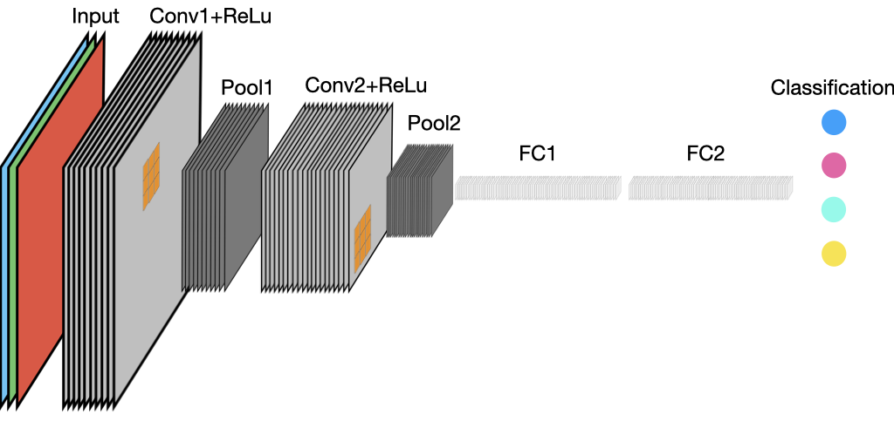

## Overview

So far we have learned a bit about multi-layer perceptrons, a type of neural network that is characterized by the fact that it is fully connected (each node in one layer is connected to every node in the subsequent layer). This complete connectedness enables the model to learn complex functions, but it has some disadvantages also. One disadvantage is that the number of parameters can get very large in networks with many nodes and multiple hidden layers (you answer a question related to this in [assignment 1](assignments/assignment1.ipynb), in fact). The second is that they have difficulties detecting features if they appear in a different location, or at a different scale, in the input dataset. That is because there is a separate weight learned for each individual input node, and weights are not shared across nodes, an MLP can only learn patterns based on where they appear in the data that were used to train the model. In other words, the patterns learned depend on the locations where they are found in the input data.

To illustrate this last point, we will use the example of handwritten digits in the MNIST dataset that we will train an MLP to recognize in our first assignment. In @fig-mnist, we see one example of a handwritten 4 from training dataset. The top four panels show the image after `torchvision.transforms.RandomCrop()` was applied to it, shifting the digits slightly (by up to 4 pixels in any direction). That transformation introduced a bit of spatial variation into the training sample, enabling the model to learn patterns that occurred in slightly different positions. However, what would happen if you wanted to train a model that could identify digits in a much larger input image, regardless of where they appear in the image? If the scale of the digits remained the same, and the images were 4X larger, as in panels E-F, there are many more places each digit could appear. For the model to learn to recognize those patterns anywhere, a much larger sample would be needed to account for that, and many more parameters would have to be calculated--recall, each pixel in the image is an input node, so an image that is 56X56 has 3,136 nodes, and if connects to a hidden layer with 1000 nodes, that is 3,137,000 learnable parameters, compared to 785,000 parameters for the 28X28 input image.

{#fig-mnist}

The problem becomes even harder if you want the model to be able to recognize digits anywhere they appear in the image, regardless of their scale, i.e. you also want to be to distinguish 4s from other numbers regardless of whether they are very large or very small. You would need to increase your training sample even more.

The issue here is that we want the model to be able to recognize patterns, regardless of where and what scale they appear in the input data. This ability is related to the concept of **invariance** (or **equivariance**), which holds that the model's capabilities should be invariant to where values of interest are found in the input. Convolutional neural networks (CNNs) are designed to provide this capability, which they achieve by processing the information at multiple scales, starting by finding relationships among immediately neighboring input values (the , and then progressively aggregating these in deep layers of the network to learn patterns across larger scales.

::: {#nte-locality .callout-note}
## Locality {#locality}

To achieve invariance, CNNs leverage the principle of *locality*, which holds that objects close to one another are likely to be correlated, whereas those farther apart are likely to be less correlated. This is a fairly basic idea in geography, and also is in physics, where it is stated that "that an object is influenced directly only by its immediate surroundings" ([Wikipedia](https://en.wikipedia.org/wiki/Principle_of_locality)). In CNNs, the first layers focus on learning patterns in small areas, and the size of the areas examined become progressively larger with each successive layer ([DiDL](https://d2l.ai/chapter_convolutional-neural-networks/why-conv.html#invariance)).
:::

CNNs, which were initially designed to work with images, achieve invariance by using layers consisting of convolutions, or sliding windows [similar to what we have used in remote sensing for many years when we apply texture measures to imagery, e.g. @estesHabitatSelectionRare2008; @tuceryanTextureAnalysis1993; @wulderAerialImageTexture1998] to convert each pixel in an image into a function of the values extracted from the pixels in a small neighborhood immediately around it (e.g. 3X3, 5X5). This use of convolutions gives CNNs an [inductive bias](https://en.wikipedia.org/wiki/Inductive_bias) (that is, the a set of assumptions that shapes what sort of patterns they can learn) towards detecting objects in images, and it also enables them to have vastly fewer parameters than MLPs.

## What are CNNs?

As described above, CNNs are a kind of neural network that is specialized for processing structured data that have a grid-like topology. They use convolutions in place of general matrix multiplication, in at least one of their layers. The design of a CNN is inspired by the visual cortex in the brain, which contains a larger number of cells that function by detecting light in small, overlapping sub-regions of the visual field, which are called receptive fields. These cells act as local filters over the input space, and the more complex cells have larger receptive fields. The convolution layer in a CNN performs the function that is performed by the cells in the visual cortex.

::: callout-note
## Convolutions and other forms of data

Although we will primarily examine CNNs that work with images, convolutional layers can process other types of structured inputs that are important in EO, such as 1d temporal, 3d spatio-temporal, or 3d spatio-spectral structures. They can even be used to recognize 4D spatio-temporal-spectral patterns.
:::

## CNN components

A basic CNN usually consists of a varying combinations of the following layers:

-   [Convolutional layers](https://pytorch.org/docs/stable/nn.html#convolution-layers) (e.g. conv1d, conv2d, conv3d)
-   Activation function layer (e.g. ReLU)
-   Normalization (e.g. batch normalization)
-   Sub-sampling layers (e.g. some type of pooling layer)
-   Fully connected layers
-   Classifier (e.g. sigmoid, softmax)

We have already discussed activation functions when we [learned about MLPs](mlp.html#commonly-used-activation-functions) and basic neural networks, so we won't return to those here (but will note here that ReLu is widely used in CNNs). In addition to that, since batch normalization is an important component of many neural networks, and we have already asked you to include batch normalization in your first assignment, we won't go into that here. However, we will come back to that later, so in preparation please read section 2.3 in [@khallaghiReviewTechnicalFactors2023a], and the [relevant section](https://d2l.ai/chapter_convolutional-modern/batch-norm.html) in Dive Into Deep Learning.

We will now look at the remaining components in more detail.

### 2D convolutions

We can think of 2d convolution as template matching, since the output at a point `(i,j)` will be large if the corresponding image patch centered on `(i,j)` is similar to `W`. If the template `W` corresponds to an oriented edge, then convolving with it will cause the output heat map to “light up” in regions that contain edges that match that orientation. More generally, we can think of convolution as a form of feature detection. The resulting output `Y = W * X` is therefore called a feature map.

A convolution layer in a CNN imposes a number of restrictions compared to a more general fully connected layer. For one, **the connections in the network are confined to a limited spatial neighborhood that is determined by the kernel size**. The result is that not every node in layer `L` is connected to every node in layer `L+1`, which stands in contrast to fully connected neural networks, where every node is connected to every other in the following layer. This means that if we limit the number of connections for each input to `k` we need `k x n` parameters and `O(k×n)` runtime. In a fully connected network, with `m` inputs and `n` outputs in a linear layer, matrix multiplication requires `m x n` parameters and `O(m×n)` runtime per example. `k` is typically much smaller than `m`.

Second, weights are shared, which means that the same weights are applied to all receptive fields in a layer. In a CNN, since the kernels are smaller than the input (`k << m`), each filter is applied to every position in the input, i.e., same filter is used for all local receptive fields (neighborhoods). As the filter moves around the image, the same weights are applied to each `f x f` set of nodes. Each filter, as such, can be trained to perform a certain specific transformation of the input space. Therefore, each filter has a certain set of weights that are applied for each convolution operation – this greatly reduces the number of trainable parameters. Less parameters results in an easier optimization problem, without losing much generality.

Multiple convolution filters are usually learned in every layer, which act as a set of spatial feature detectors. Further, convolutions preserve information about the location of input features (modulo reduced resolution), providing the property known as invariance, or equivariance.

In `PyTorch`, convolutional layers are implemented through `nn.ConvXd`, where `X` is replaced by the proper dimensions (1,2, or 3). Since we are talking here about 2D convolutions, it would be `nn.Conv2d`.

#### 2D Convolution operation

A convolution is calculated by summing the element-wise multiplication of pixel values in an input patch (neighborhood) by the corresponding values in the kernel's weight matrix (@fig-2dconv-operation).

)](https://indoml.files.wordpress.com/2018/03/convolution-operation-14.png?w=736){#fig-2dconv-operation fig-align="center"}

We can extend the definition of convolution to multispectral input (e.g. 2d conv over 3d input) by defining a kernel for each input channel; thus now `W` is a 3d weight matrix or tensor.

::: callout-note
### Convolution versus cross-correlation
While we use the term convolution here (as is more generally done in deep learning), the actual operation is technically a cross-correlation. Convolution entails flipping the kernel, whereas the kernel is not flipped in cross-correlation. For more details for [DiDL](https://d2l.ai/chapter_convolutional-neural-networks/conv-layer.html#the-cross-correlation-operation).
:::

We compute the output by cross-correlating channel c of the input with kernel `W[:,:,c]`, and then sum over channels (@fig-2dconv-3band). Each filter has one kernel per input channel (3 in this example), which are summed once run to make a single output feature map, which becomes one in the specified number of features maps (2 in this example). In the next layer, each filter will have two kernels, one per feature map in the input.

)](images/3band-conv.gif){#fig-2dconv-3band fig-align="center" width="80%"}

Each filter tries to identify a particular type of spatial pattern in a small rectangular region of the image (receptor field), and thus many filters are needed to capture the variety of possible shapes in the image. These shapes are combined in later layers, where they are used to recognize more complex patterns and eventually produce the output prediction.

::: callout-note
### Convolutional filters, shapes, and network depth

The activations of the filters in the early layers are low-level features like edges, whereas those in later layers put together these low-level features. For example, a mid-level feature might put together edges to create a hexagon, whereas a higher-level feature might put together the mid-level hexagons to create a honeycomb.
:::

The number of filters used in each layer controls the capacity of the model because it directly controls the number of parameters.

We are talking here about 2D-convolution, but 3D-convolution is also practiced. In 2D convolution over a volume, the depth of a filter is always the same as that of the layer to which it is applied to (e.g. the three inputs bands). In a 3D convolution, the convolution layer also moves in the 3D-dimension, with some specified width that may be less than the total volume (@fig-2d-vs-3dconv).

)](images/2D-and-3D-convolution-operations.png){#fig-2d-vs-3dconv}

#### Padding

Since 2D convolutions are moving windows that cover a neighborhood larger than 1 pixel, they always have the problem of dealing with pixels on or near the edge. This poses two problems:

1.  Edge pixels contribute less in the output of the convolution.

2.  Without adjustments, the output size is reduced by the half-width of the kernel

Padding, which often takes the form of adding one or more zeros to the image border, addresses these two problems, by allowing us to keep more information at the border of an image. Adding padding is often referred to as **same convolution**. Without padding, very few values at the next layer would be affected by pixels at the edges of an image. It also allows you to use a convolutional layer without necessarily shrinking the height and width of the volumes. This is important for building deeper networks, since otherwise the height/width can shrink to nothing if the network is deep enough. Another issue is more technical: coding with same convolutions is easier, and the modeling pipeline can become more flexible regarding the size of the input.

::: {#nte-rf .callout-note}
## Padding terminology

-   Valid convolution: Convolutions without padding
-   Same convolution: Padding added to make the output size equal to the input size.
-   Full convolution: In this setting every possible partial or complete superimposition of the kernel on the input feature map is taken into account. Full padding convolution starts by matching the right corner of the kernel to the lower left corner of the corresponding image patch, and continues until the upper right corner of the kernel matches the lower left corner of the image patch, resulting in an output with a bigger size than the original input.
:::

#### Stride

Stride is the number of pixels by which we shift our kernel over the input matrix each time it is moved. Since each output pixel is generated by a weighted combination of inputs in its receptive field (based on the size of the filter), neighoring outputs will be very similar in value, since their inputs are overlapping. We can reduce this redundancy (and speedup computation) by skipping every $s^{th}$ input. This is called strided convolution.

When the stride is 1 then we move the filters one pixel at a time. When the stride is 2, then the filters jump 2 pixels at a time as we slide them around.

A conv layer with stride of 2 downscales the output by factor of 2. For this reason a conv layer with a stride \> 1 can be used to downsample the image.

::: callout-note
### What is a receptive field?

The size (height and width) of the filter defines its **receptive field** (RF), or the set of pixels on which a neuron depends. It quantifies how far a neuron can “see” in the image. Note that the size of the filter can be modified in each layer.

In most applications, a large amount of spatial context must be taken into account in order to successfully label the images. For example, to determine that a certain pixel belongs to a rooftop, it is likely insufficient to just consider its individual spectrum: we will need to observe the area around this pixel, taking into account the geometry and structure of the objects, to infer its correct class.

The **effective receptive field (ERF)** refers to the area of the original image that can influence the activation of a neuron in an intermediate hidden layer. Whereas the RF is simply equal to the filter size in the previous layer, the ERF tracks back through each layer back to the input image, and indicates the extent of the input image that affects the activity of the neuron in the given intermediate layer. The RF and ERF are the same for the first convolutional layer. The RF in deeper layers is larger than the RF of units in shallow layers.

)](https://miro.medium.com/v2/resize:fit:1400/format:webp/1*k97NVvlMkRXau-uItlq5Gw.png)

Calculating the size of the ERF helps a CNN developer to choose suitable filter sizes for addressing particular tasks. From a Geographer's perspective, the ERF can be tied to the characteristic scale of the objects of interest in the landscape being analyzed.

Examining the RF and convolution operations shows that not all pixels in a receptive field contribute equally to an output unit’s response. Pixels at the center of a receptive field have a much larger impact on an output. In the forward pass of the model, central pixels can provide information to the output through many different paths, while the pixels in the outer area of the RF have few paths to propagate their impact. In the backward pass, gradients from an output unit are propagated across all the paths, and therefore the central pixels have a much larger magnitude in the gradient from that output.

Further studies showed in many cases, the distribution of impact in an RF has a **Gaussian** distribution. This implies that the effective area in the RF only occupies a fraction of the theoretical RF, as Gaussian distributions generally decay quickly from the center.

The Gaussian effect is most pronounced when using valid convolutions, less influential with same (padded) convolutions, and mostly disappears with full convolution.
:::

### 1×1 (pointwise) convolution

Sometimes we just want to take a weighted combination of the features at a given location, rather than across locations. This can be done using 1x1 convolutions, also called pointwise convolution. This changes the number of channels from $C$ to $D$, without changing spatial dimensions. Pointwise convolution can be conceived of as a single layer MLP applied through each column of a stack of feature maps.

1X1 convolutions can be used to either reduce or expand dimensionality, but are most typically used for the former purpose. They are widely used in many modern architectures, such as the Inception module in GoogLeNet, in order to reduce the number of parameters and computational cost.

)](https://miro.medium.com/v2/resize:fit:1400/format:webp/1*dNaikOfrGzUaJ2EzRIl4tw.png){#fig-1x1 width="70%"}

### Pooling layers

A pooling layer operates on blocks of the input feature map to spatially aggregate the feature activations. This aggregation operation is commonly defined by a fixed function, such as the average or the max functions, and has no learnable parameters in the backpropagation step.

The purpose of the pooling layer is twofold:

1.  To further increase spatial invariance by reducing the resolution of the feature maps, without increasing the number of learnable parameters in the network.
2.  To increase the receptive field throughout the network.

The use of pooling can be thought of as adding an assumption that the function the layer learns must be invariant to small translations. When this assumption is correct, it can greatly improve the statistical efficiency of the network. Setting the size of the pooling kernel decides how *invariant* or robust to distortions we want the representation to be. It is best to pool slowly throughout the network after a few convolution layers.

The size of the output of the pooling layer depends on the stride between the pools, the pool kernel size, and spatial dimensions of its the input.

$$
\begin{align}
h' & = \lfloor\frac{h-f+s}{s}\rfloor\\  
w' & = \lfloor\frac{w-f+s}{s}\rfloor \\
\end{align}
$$

The computational cost of the pooling layer is proportional to the size of the input, and is negligible compared to a convolutional layer. Usually we choose a pooling stride that gives us non-overlapping regions, and zero-padding is often used in pooling operations. Pooling is separately applied to each feature map.

The most common pooling technique is max-pooling. Max-pooling simply outputs the maximum value in the input region. An alternative is to use average pooling, which replaces the max by the mean. In either case, the output neuron has the same response no matter where the input pattern occurs within its receptive field.

::: {#fig-pooling layout-nrow="1"}
{#fig-mxp} {#fig-mup}

Max (left) and average (right) pooling of a 4X4 input using a 2X2 kernel ([credit](https://www.baeldung.com/cs/neural-networks-pooling-layers))
:::

Max pooling provides significant help in pattern recognition, because it discards less significant data while preserving the detected features in a smaller representation. The reasoning behind pooling operations is that feature detection is more important than the feature’s exact location. Computing the maximum value is inspired by the idea of detecting objects from their parts. For example, in a face detector it is important to identify the constituents of a face, such as hair or nose, while the exact locations of these components should not be a determinant factor. The max pooling layer conveys then to which extent there is evidence of the existence of a particular feature in a given vicinity.

The downside of pooling operations (and downsampling in general) is that it hard-codes robustness to spatial deformations, a virtue that boosted the success of CNNs for simple problems, such as image categorization. However, spatial precision is lost when downsampling. The increased RF (and thus recognition capability) comes at the price of losing localization capability. This well-reported trade-off is a major concern for dense prediction problems (e.g. semantic segmentation).

Max and average pooling are implemented as `nn.MaxPoolXd` and `nn.AvgPoolXd`, respectively, in `PyTorch`.

#### Pooling variants

If we average over all the locations in a feature map, the method is called **global average pooling**, which enables us to convert a `H × W × D` feature map into a `1 × 1 × D` dimensional feature map. This can be further reshaped to a D-dimensional vector and passed into a fully connected (FC) layer, then mapped to a C-dimensional vector before passing into a softmax output. The use of global average pooling means we can apply the classifier to an image of any size, since the final feature map will always be converted to a fixed D-dimensional vector before being mapped to a distribution over the `C` classes. Alternatively, we can use global max pooling.

This layer is implemented under the name `nn.AdaptiveMaxPoolXd` and `nn.AdaptiveAvgPoolXd`.

## A complete CNN

An example of a simple CNN archiecture with two convolutional layers wth ReLu activations, followed by pooling and a final classifier, is shown in @fig-simplecnn, where a 3-band RGB image is fed into a network that starts with a convolutional layer with 10 filters with a 3x3 kernel and ReLu activation, followed by a pooling that reduces the spatial dimensions by a factor of 2, followed by a second convolutional layer with 20 filters, which is again pooled and then passed through two fully connected layers to a final classification into one of four values.

{#fig-simplecnn}

A more complex CNN is illustrated in @fig-vgg16, which is the structure of VGG-16 [@simonyanVeryDeepConvolutional2015], a model designed to classify imagery from the [ImageNet](https://image-net.org/) benchmark dataset into one of a thousand classes. The model takes an input image with 3 bands and spatial dimensions of 224x224, and consists of several layers in which pairs or triplets of convolutional layers with kernel sizes of 3x3 followed by ReLu activations that are fed to a max pooling layer, which reduces the output dimensions by a factor of 2. The number of filters in the convolutional layer are doubled in each successive layer.

).](https://learnopencv.com/wp-content/uploads/2023/01/Convolutional-Neural-Networks.png){#fig-vgg16}

For example, the first level has two convolutional layers, each with 64 filters, and each followed by a ReLu activation, resulting in feature maps of 224x224, which are then pooled to 112x112. These are then fed to the next two convolutional layers, each of which have 128 filters. The final set of convolutional layers have three separate sets of convolutional layers each having 512 filters with dimensions of 14x14, which are then pooled to 7x7 and passed to 3 fully connected (FC) layers (i.e. an MLP), followed by a softmax classifier. To go into the FCs, the output of the final max pooled layer is flattened from 7x7x512 to 1x1x2058, and then enters the first FC of 1x1x4096, followed by a second of the same size, and a third of 1X1X1000 (matching the number of predicted classes).

::: callout-note
## Sequential convolutional layers

Stacking two convolutional layers, each with 3X3 kernels, produces a RF that is equivalent to that of a single convolutional layer with a 5X5 kernel size, but for fewer learnable parameters [@khallaghiReviewTechnicalFactors2023a].

Note that a layer with a single convolutional filter with a kernel size of 3x3 receiving a 3 band input image will have 3x3x3 weights plus a bias, resulting in 28 learnable parameters. The same layer with a 5x5 kernel will have 5x5x3+1 (76) learnable parameters, thus stacking two layers, each with a single 3x3 kernel filter will require only 54 parameters, which is 71% of the parameters of the layer with a single 5x5 kernal filter.
:::

## CNNs in PyTorch

We will start to work with implementing CNNs in [Assignment 2](assignments/assignment2.html). In that assignment, you will create and train a basic CNN based on one of the first ones created [@lecunGradientbasedLearningApplied1998], and use more complex pre-trained CNNs that are provided with `PyTorch` to make predictions on images. We'll learn more about these models in the next sections.
