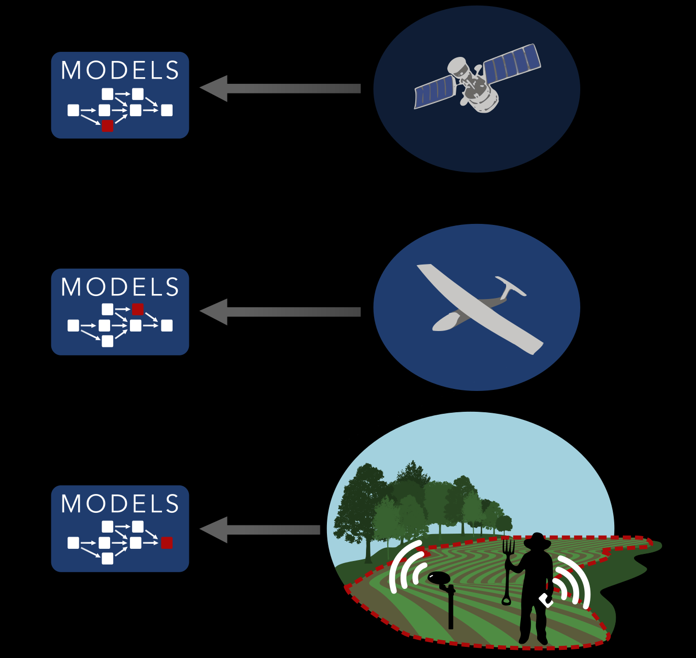
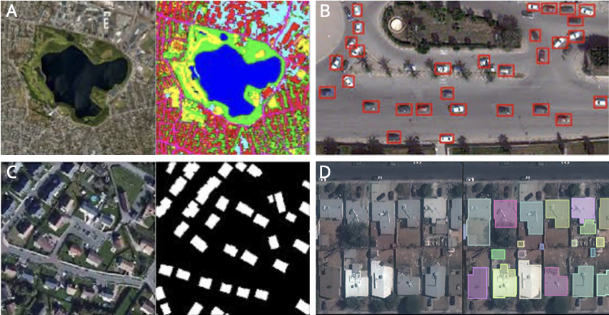

## What is deep learning?

We will define this more precisely in subsequent sections, but deep learning is essentially a subset of machine learning, which is simply defined as:

> ...the study of algorithms that can learn from experience. As a machine learning algorithm accumulates more experience, typically in the form of observational data or interactions with an environment, its performance improves ([Dive into Deep Learning](https://d2l.ai/chapter_introduction/index.html#a-motivating-example) (DiDL))

Deep learning models provide many of the capabilities that underpin *artificial intelligence*, which is "...the science and engineering of making intelligent machines, especially intelligent computer programs ([McCarthy, 2007](https://www-formal.stanford.edu/jmc/whatisai.pdf))". They are based on neural network architectures, which were designed to mimic the functioning of animal brains ([Wikipedia](https://en.wikipedia.org/wiki/Artificial_neural_network)). Deep learning models are neural networks with multiple layers, which allow them to model highly complex, non-linear functions.    

## What is Earth Observation?

Earth Observation (EO) can be roughly defined as a combination of methods and technology used to remotely measure and monitor the patterns and processes of the Earth. EO covers a wide variety of subjects, ranging from counting individual animals to estimating crop yields to rainfall estimation to mapping land cover types (which is one of the most common applications). EO data is collected using a variety of different sensors, including multi- and hyperspectral optical, radar, and lidar, which can be mounted on orbiting satellites, [aerial drones](https://aerialfiremag.com/2023/11/06/wildfire-drones-detect-coordinate-contain-fighting-the-wildfire-upsurge/), [traditional aircraft](https://asnerlab.org/projects/global-airborne-observatory/), and even [kites](https://journals.plos.org/plosone/article?id=10.1371/journal.pone.0073550). EO further extends to ground-based [sensors](https://www.arable.com/mark3/) streaming data via cell phone networks, [street view cameras](https://svsdataset.github.io/), and even to observations collected *beneath* the surface, using, for example, [submersible vehicles](https://oceanexplorer.noaa.gov/technology/subs/auvs/auvs.html) to collect data from deep in the oceans.

In addition to data capture, EO involves further steps related to data processing and analysis, which can be thought of as a  pipeline. First, specific techniques are used to process the captured data (e.g. to correct geometric and atmospheric distortions--you learn about this in Intro to Remote Sensing), followed by steps to convert the data into forms that can be readily analyzed. These processed images are then typically ingested by a model that is trained to extract meaning from the data. Increasingly, deep learning models are being used for this final step, given their strong capabilities to identify patterns and features of interest in various kinds of EO data.   

{#fig-eo fig-align="center" width="50%"}

## A (Very) Brief History of Machine Learning in EO {#sec-history}

Machine learning (ML) started appearing in EO research around the late late 1990s to early 2000s, and its use has grown rapidly since. The first algorithms to be used included support vector machines [@scholkopfNewSupportVector2000], regression trees, and Random Forests [@breimanRandomForests2001], and even early versions of artificial neural networks (ANNs). One earlier comparison of several ML algorithms for land cover mapping is provided by @roganMappingLandcoverModifications2008, while a more recent one is provided by @maxwellImplementationMachinelearningClassification2018. Random Forests, in particular, has become a mainstay for EO applications, given its generally high performance, relative ease of implementation, and ability to achieve robust results with fairly small and even noisy training data [@elmesAccountingTrainingData2020]. The ease of use for Random Forests has only grown with its inclusion in Google's [Earth Engine](https://earthengine.google.com/) platform [@gorelickGoogleEarthEngine2017], which has enabled Random Forests to be applied at increasingly large scales. Prominent examples include 30 m resolution maps of [global croplands](https://www.usgs.gov/apps/croplands/app/map?lat=0&lng=0&zoom=2) [see @xiongNominal30mCropland2017 for the approach used to map Africa's croplands], and, more recently, a <5 m resolution map of tree cover for Southeast Asia [@yangImprovedFinescaleTropical2023]. 

It is interesting to note the dates of the first comparison paper [@roganMappingLandcoverModifications2008] and the last review paper [@maxwellImplementationMachinelearningClassification2018] mentioned above, and that both papers largely cover the same ML methods, 10 years apart. This gap illustrates the lag between the availability of ML methods and their adoption by EO practitioners. Indeed, a review of land cover mapping studies conducted between 2000-2012 [cited and supported by @maxwellImplementationMachinelearningClassification2018] found that nearly 1/3 of surveyed papers relied on maximum likelihood classifiers, despite the fact that machine learning classifiers were already availabile and were known to be superior [@yuMetadiscoveriesSynthesisSatellitebased2014a]. The authors attributed this reliance on the older, less effective classifiers to their ready availability in the image processing software typically used by EO practitioners, which at the time presumably lacked built-in machine learning classifiers. 

The underlying reason for the adoption lag is because machine learning algorithms are developed in other fields, such as computer science, and are initially applied for other purposes (e.g. natural language processing). EO scientists and practitioners, who are not typically trained in machine learning techniques, had to first become familiar with these tools, then adapt them to the different modalities of EO data, and finally integrate them with their software. We can see this same lag, which appears to be about 5-10 years, in the use of deep learning models in EO. In fact, @maxwellImplementationMachinelearningClassification2018 excluded deep learning from their review, stating that: 

> We do not consider the many new machine-learning algorithms...and deep convolution neural networks (Yue et al. 2015)], because such methods have not yet been widely adopted.

Yet breakthroughs in deep learning for image classification had been made in 2012 [@krizhevskyImageNetClassificationDeep2012], and the widely used U-Net architecture [@ronnebergerUNetConvolutionalNetworks2015], first applied to segmenting cellular structures in electron microscope slides, was published three years earlier than Maxwell *et al*'s paper. However, things are now changing rapidly, and the use of deep learning is accelerating, such that the time lag between model availability and uptake is shrinking. One example of this shrinking is seen in the ongoing collaboration between Clark's Center for Geospatial Analytics, NASA, and IBM, which developed a so-called *foundation* model (a general purpose model) for EO using a Vision Transformer model as a key compoent [@jakubikFoundationModelsGeneralist2023]. The original Vision Transformer model was first published in 2021, and was originally developed for segmenting ordinary imagery [@dosovitskiyImageWorth16x162021a]. 

Given the emerging capabilities of deep learning models and the growing corpus of EO data, it is essential for EO professionals and data scientists interested in geospatial data to gain a working understanding of how to apply these models to derive useful insights from EO data.  

## Types of models and problems 
There is a huge and growing variety of deep learning architectures, which fall under the general categories of convolutional neural networks, recurrent neural networks, generative adversarial networks, transformers, deep belief networks, graph neural networks, and others, with a large diversity of different types under each category, and frequent co-mingling and hybridization across these general classes [@khallaghiReviewTechnicalFactors2023a]. 

These models are applied to solve a variety of different problems, a number of which are listed in [Dive Into Deep Learning](https://d2l.ai/chapter_introduction/index.html#supervised-learning), and includes regression problems (predicting a quantity), classification, sequence analysis, making recommendations, synthesizing data, and others. These problems can also be broken into several different kinds of sub-problems. For example, a classification problem can relate to text (e.g. the sentiment expressed a social media post) or to imagery (does the photo contain plant or an animal). For EO, the most relevant example is image classification, which can take several forms, as illustrated in @fig-classifications. These include segmentation segmentation, in which each pixel is grouped and assigned membership to a particular class; instance segmentation, which is when distinct groups of pixels representing individual examples (instance) of a class (e.g. a building, a tree, a crop field) are assigned individual identifiers; objection detection, where individual objects of a class or classes are detected and their locations indicated. An entire image can also be classifed; for example, the images in @fig-classifications C or D could be labelled simply as "town" or "urban". 

{#fig-classifications}

These sorts of deep learning-based classifications are often made using convolutional neural networks, which learn from spatial context. Sequence analysis, or "sequence learning" ([DiDL](https://d2l.ai/chapter_introduction/index.html#sequence-learning)'s phrasing) is another type of problem solved by certain classes of deep learning models, one that is highly relevant to EO. In this case, the model learns patterns that arise in sequences of data that are correlated with the relative order and distance of objects in the sequence. For example, words in a passage of text have particular relationships with one another, such as the following sentence: 

> Next semester, I will be attending Clark University and plan to take a class in *statistics*.

Each successive word narrows the scope of possible words that come after it, because speech is governed by linguistic rules that establish an order for particular kinds of words (subject noun, verb, adjective, object noun), and certain words are used more often with some words and less often with others. By the time you get to the end of the sentence above, *class in* would be most plausibly associated with a word or phrase that is associated with classes offered at a University. There are deep learning models that learn the relationships between words in passages of text so that they can predict what words are most likely to come next. 

In EO, satellite image time series are image sequences that capture temporal changes on the Earth's surface arising from seasonality, weather, or disturbances. The relative order and magnitude of these changes, encoded in reflectance (or radar backscatter), varies according to the nature of the surface feature and process. For example, a time series of Sentinel-2 images collected over the course of a year will produce an NDVI curve that looks very different over a forest than one collected over buildings (@fig-ndvi).  

```{python}
#| echo: false
#| label: fig-ndvi
#| fig-cap: "A time series of NDVI from Sentinel-2 imagery collectd over a farm in northeastern South Africa. One point was collected over a tree plantation, the other over a group of farm buildings."
import pandas as pd
ts_data = pd.read_csv("data/ndvi_times_seriesf.csv")
ts_data.plot(x="date", y=["Trees", "Buildings"], ylabel="NDVI", xlabel="Date")
None
```

These temporal sequences can be learned and associated with different land cover types, so that those types can be predicted. We used this approach in a [recent project](https://cropanalytics.net/wp-content/uploads/2022/11/Farmerline-Clark-Round-2-Report-V2-Nov-8-2022.pdf) to map crop types in Ghana and Tanzania, using time series of both Sentinel-1 and 2 along with a 1-D convolutional neural network to map maize and rice [@wussahFinalReportPhase2022]. 

In this course, we will focus primarily on solving EO classification problems, particularly semantic segmentation, using convolutional networks. We will also learn about models that can learn from satellite time series to solve classification problems. In addition to these, we will touch on generative models and their role in both synthesizing and classifying imagery, and cover attention mechanisms, the building blocks of transformers, which are rapidly growing in use (see @sec-history).  

That was a *very* brief overview of what we'll cover in this course. We'll now turn next to learning some of the basics of neural networks. 


