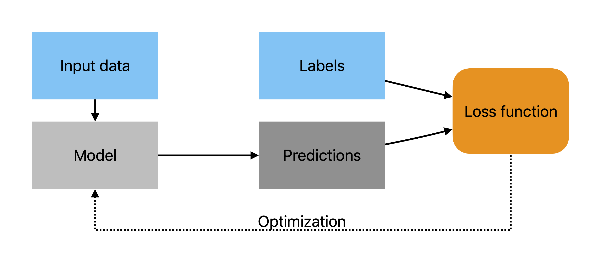

::: {.callout-note}
## Credits 
The material in this chapter is adapted from [Dive Into Deep Learning](https://d2l.ai) and from slides developed by Sam Khallaghi. 
:::

## Neural networks
As we discussed in the [previous chapter](introduction.html#what-is-deep-learning), deep learning refers to neural networks with multiple layers, and mentioned that neural networks were designed to mimic the neural functioning in animal brains (hence the name). Let's dig into this a little bit more by examining simplified artificial neural networks shown in (@fig-nnets), after first setting out some terms: 

- $I$ = the input layer of a neural network (where the data are fed in), consisting of multiple nodes, each of which represents an individual piece of data (e.g. a pixel in an image)
- $O$ = the ouput layer of a neural network, consisting of one or more nodes, containing the model's predictions for what target values are associated with the input
- $H$ = a hidden layer between the input and output of a neural network, consisting of multiple nodes
- $W$ = a vector of weights multiplied with either I or H, containing one unique weight $w$ for each individual node $i$ of I (or $h$ of $H$). These weights are learned by the model, and are what enable the input values to be transformed to output predictions
- $b$ = a vector of biases that are added after W is multipled with I or H. There is a unique bias value for each node in the next layer
- $f$ = A function used to transform continuous model predictions into the target value range, such as the Softmax function $S$ 
- $\sigma$ = A non-linear activation function   

Having established those terms, we'll first look at the simplest neural network (known as a perceptron), which has a single input layer $I$ that connects directly to the output layer $O$ (@fig-nnets A). Here $I$ has just two nodes (which are analagous to neurons), which are transformed by a function to make the output prediction $O$, which has a single value output. That function is essentially a linear model: 

$$O = w_1i_1 + w_2i_2 + b$${#eq-1}

With $b$ is a bias term and $w_1$ and $w_2$ are weights learned during model training, and respectively applied to the individual nodes $i_1$ and $i_2$ of I. 

![Simplified neural network structures, showing a (A) simple 1-layer network (a perceptron) with 1 input layer (I) with two nodes and an output layer (O) with one node; B) a shallow neural network with a single hidden layer with three nodes (H) between the two node input (I) layer and single node (O) output layer; C) a deep neural network with two 3-node hidden layers. Increasing the number of hidden layers, as well as the width of those layers (number of nodes) increases the complexity of the function that the network can approximate. The models in B and C can also be considered examples of multi-layer perceptrons.](images/2-neural-nets.png){#fig-nnets}

@eq-1 can be simplifed to: 

$$O=W \cdot I + b$${#eq-2}

Which is convenient, since there may be hundreds to thousands of nodes in I, so W and I contain the values for each input node and weight value in matrix form. We finally complete this simple model by adding one more term:

$$O=S(W \cdot I + b)$${#eq-3}

Here $S$ is a function that may be applied to the outputs of @eq-2 to further transform the value, say from a continuous to binary value. 

Increasing in complexity, the network in @fig-nnets B has a hidden layer (H) between input and output layers, in this case with three nodes. Each node in the input layer is connected with each node in the hidden layer, and each node in the hidden layer is connected with the node in the output layer. That means the network is fully connected (although there are no connections between the nodes in each layer), and the connections flow in one direction--from I to O--making this a [feed-forward](https://en.wikipedia.org/wiki/Feedforward_neural_network) neural network. This network is also called a multi-layer perceptron, which in this case has two layers--the hidden layer and the output layer (the input layer doesn't count, since these are just the raw data values, per [DiDL](https://d2l.ai/chapter_multilayer-perceptrons/mlp.html#incorporating-hidden-layers)). The same internal function shown in @eq-1 is used to connect each layer, but there is one function per receiving node, so we now have three separate functions connecting I to H:

$$
\begin{split}
h_1 = w_{11}i_1 + w_{21}i_2 + b_1\\
h_2 = w_{12}i_1 + w_{22}i_2 + b_2\\
h_3 = w_{13}i_1 + w_{23}i_2 + b_3
\end{split}
$${#eq-4}

Such that there are unique weights and biases learned for each node in H. Here the notation for weights is $w_{ij}$, where *i* indicates the number of the neuron in the input and *j* the position of neuron in the output. As seen between @eq-1 and @eq-2, we can simplify using matrix notation: 

$$H=WI + b$${#eq-5}

And, we can complete the function by adding an additional term $\sigma$:

$$H=\sigma(W \cdot I + b)$${#eq-6}

Which is an *activation function* that, similar to $S$ in @eq-3, is a non-linear transform of the outputs of the inner equations. The activation function enables the network to model complex, non-linear forms. We will cover these in more detail later, but for now we will note that without the activation function, the model would essentially reduce to a linear function. To make the full model, @eq-6 is wrapped in another function connecting the hidden layer to the output, thus the model is comprised of these individual functions: 

$$
\begin{split}
H&=\sigma_1(W_1I + b_1)\\
O&=S(\sigma_2(W_2 \cdot H + b_2))
\end{split}
$${#eq-7}

These are then combined as:

$$
O=S(\sigma_2(W_2 \cdot \sigma_1(W_1 \cdot I + b_1) + b_2))
$${#eq-8}

The same construction applies to the model in @fig-nnets C, except it now has two hidden layers, giving it the form of:

$$
O=S(\sigma_3(W_3 \cdot \sigma_2(W_2 \cdot \sigma_1(W_1 \cdot I + b_1) + b_2) + b_3))
$${#eq-9}


There are a few important things to note about the model described by @eq-9. First, because the model has at least two hidden layers, it can be considered a [**deep**]{style="text-decoration: underline;"} neural network. Second, the additional hidden layer further increases its ability to represent complex, non-linear forms. Third, the hidden layers and their nodes represent additional features (predictors) that are extracted and learned by the model during the training process. This contrasts with earlier generation ML models, for which features are typically pre-defined and manually calculated beforehand, and passed to the model as part of the input data. For example, if you have ever applied Random Forests [@breimanRandomForests2001] to classify a satellite image, you probably calculated vegetation indices from the bands to provide one or more additional predictors [e.g. @xiongNominal30mCropland2017]. In deep learning models, a large number of additional features are derived from the input data automatically, which is one of their major advantages. For more detail on this aspect of deep learning models, see paragraph 2, page 2 in Part 1 of  @khallaghiReviewTechnicalFactors2023a.  

The second point mentioned above assumes that the model was trained effectively, such that its parameters (weights and biases) enable it to estimate values of the target variable in the input data with minimal error. We'll look at how deep neural networks (DNNs) are trained in the next sections.  

## Training deep learning models
To understand how models are trained, let's take a step back and look at the general approach used to solve a machine learning problem. A machine learning problem consists of the steps in the box below:

::: {#nte-mlproblem .callout-note}
## Solving an ML problem
1. Define the problem you are trying to solve. For example, classifying crop fields in satellite imagery
2. Collect two types of data necessary to solve the problem: 
    - Data providing the **predictor** variable, alternatively termed *features* ([DiDL](https://d2l.ai/chapter_linear-regression/linear-regression.html#basics)). In EO, the features are often provided by multi-band satellite imagery
    - **Labelled data**, also known as the *target* ([DiDL](https://d2l.ai/chapter_linear-regression/linear-regression.html#basics)), which define the objects/values of interest in the predictor data. In this example, the labels would be binary imagery co-located with the satellite imagery, having 0 values for pixels that are not crop fields, and 1s for pixels that are part of crop fields
3. Select an algorithm, which consists of choosing: 
    - A particular **model** architecture and design. The diagrams in @fig-nnets represent highly simplified model architectures.   
    - An **objective function** for evaluating model performance, also known as a **cost** function, or most commonly, a **loss** function, which measures the distance between the model's predicted values and the target values (labels) after each update (models are trained iteratively) of the model's parameters (weights and biases), providing information on whether parameter changes improve or worsen the model's fit.   
4. Select an **optimization algorithm** for training the model. This algorithm finds the best (optimal) parameter values for the model, drawing on information provided by the objective function.  
5. Select a quantitative **metric**(s) for evaluating the trained model's performance. There are many different metrics available, including overall accuracy, precision (User's accuracy, for those of you coming from remote sensing), recall (i.e. Producer's accuracy), and many others.  Often several metrics are used, and they are applied to evaluate model predictions against labelled data that were not used to train the model. 
:::

The key components in training the model are the objective function and the optimization algorithm, and the labelled data, which work together as shown in @fig-training. The input data is fed into the model, which assigns an intial set of parameters and uses those to make a first set of predictions. Those predictions are then compared to the labels, which provide the target values, i.e. the "truth". The comparison is made using the objective function, which we will refer to from now on as the loss function, because most objective functions used in deep learning are formulated such that the lower the value, the better the model's performance [DiDL](https://d2l.ai/chapter_introduction/index.html#objective-functions). Once the loss is calculated, the optimization algorithm is applied to update the model's initial parameters to minimize the loss, and thereby improve model performance. This parameter update -> prediction -> loss calculation -> optimization process repeats until the model ceases to improve further.

{#fig-training fig-align="center"}

We'll learn a bit more detail about these key components in the next few sections.

### Loss functions
As mentioned above, the loss function is used to calculate how far away the model's predictions are from the labels that define the values of the target variable in the input data. The "loss" in the name refers to how much information is lost by the model's errors. Loss functions play a critical role in determining how effective deep learning models are, and there is a huge literature regarding loss functions [see, for example, citations in @khallaghiReviewTechnicalFactors2023a]. 

Chapters [2](https://d2l.ai/chapter_linear-regression/linear-regression-scratch.html#defining-the-loss-function) and [3](https://d2l.ai/chapter_linear-classification/softmax-regression.html#loss-function) in Dive into Deep Learning provide examples of two kinds of loss functions, one for the case of a model predicting a continuous variable, and one for a categorial variable. The continuous case is essentially a linear regression, in which the model predicts the value ($\hat{y}$) of a continous target variable ($y$), and the loss is:

$$L(\hat{y},y) = \frac{1}{n}\sum_{i=1}^{n}(\hat{y}_i - y_i)^2 $${#eq-lmloss}

Which is average squared difference between each pair $i$ of predictions and labels for all $n$ pairs in the training sample. This is the mean squared error, also known as quadratic loss. We can easily see from @eq-lmloss that if $\hat{y}$ is equal to $y$, then the loss will be 0.  

For the categorical case, where the model is trained to distinguish between different classes in the input dataset, we have a different construction. First, a model trained on categorical variables initially produces [logit values](https://en.wikipedia.org/wiki/Logit), and it produces one such value for each category being classified. For example, in a model that tries to distinguish between buildings, trees, and roads in an image, it will produce a vector of three logits, say:

$$
\hat{y} = (3, 1, -0.5)
$$

Which are the predicted values for each of the three classes,respectively, for a single input observation. These have to be normalized into probabilities that fall between 0 and 1 and sum to 1, which is done using the [softmax function](https://en.wikipedia.org/wiki/Softmax_function): 

$$
S(\hat{y}) = \frac{e^{\hat{y}_i}}{\displaystyle\sum_{k} e^{\hat{y}_k}}
$${#eq-softmax}

Note that the softmax here is a specific form of the general function $S$ mentioned in @eq-3 - @eq-8. It results in the following values:

$$
\hat{y} = (0.858, 0.116, 0.026)
$$

The largest probability thus becomes the predicted class for this observation (buildings). To calculate the loss, the widely used *cross-entropy loss* can be used: 

$$
L(\hat{y},y) = -\sum_{k=1}^{K}y_{ik}log(\hat{y}_{ik})
$${#eq-ce}

In which the $\hat{y}$ is the softmax prediction for each observation $i$ for class $k$. For our three-class example, if the label indicates that the observation in question corresponds to a building (a label value of 1, with the other two classes set to 0, see note on one-hot encoding), the calculated loss becomes: 

$$
L(\hat{y},y) = −1 \cdot log(0.858) − 0 \cdot log(0.116) − 0 \cdot log(0.026) = 0.153
$$

As with the continuous case, the smaller the loss value the better. In this example, the model predicts a high probability for the same class as the label (buildings), so the loss is relatively small. If the softmax predictions were instead (0.6, 0.2, 0.2), indicating the model was less certain about this class, the loss would be substantially higher (0.511). 

::: {#nte-onehot .callout-note}
### One-hot encoding
Categorical variables are stored using [one-hot encoding](https://en.wikipedia.org/wiki/One-hot), in which a vector of binary values is used to represent the classes of interest. In our example, we would have the following vectors:

$$
\begin{align}
\mathrm{buildings} = (1, 0, 0)\\
\mathrm{trees} = (0, 1, 0)\\
\mathrm{roads} = (0, 0, 1)
\end{align}
$$
:::


::: {#nte-differentiable .callout-note}
### Loss functions are differentiable
One important thing to remember about the loss function is that it is differentiable. This property enables the model weights to be updated incrementally, because it allows the instantaneous slope of the cost function for each model parameter in the direction of the optimal value to be calculated ([Jordan](https://www.jeremyjordan.me/gradient-descent/)).  
:::

### Optimization
After calculating the loss, the optimization algorithm (the optimizer) uses that information to update the model parameters, so that the loss can be further minimized. The job of the optimizer is to find the distance between the target and the model's predictions, i.e. to minimize the loss. There are a number of algorithms used for this (see [Chapter 12](https://d2l.ai/chapter_optimization/index.html) in DiDL for a subset of these), but what these typically have in common is that they constitute gradient-based learning, and are based on an approach called *gradient descent*. 

#### Gradient descent {#sec-gd}
##### Gradients
Gradient descent works by gradually updating the parameters of the model in the direction along a gradient that minimizes the loss. To understand this, let's start by defining a gradient. There are several definitions (at its simplest it is simply the slope of a line), but the relevant one here comes from vector calculus, where it refers to the first derivative of a multivariate function that provides both the direction and maximum rate of increase from any point on the surface of that function ([Wikipedia](https://en.wikipedia.org/wiki/Gradient)). The negative of the gradient provides the direction and rate of maximum rate of decrease towards the closest minimum point on the surface of the function, which we can visualize as the lowest point of valley in a hilly landscape. Such a minimum point represents the value (here a parameter) that optimally minimizes the function (e.g. points in @fig-gradients). When the minimum point is reached, the function is optimized. If the function is convex (see [here](https://d2l.ai/chapter_optimization/convexity.html) for a detailed definition of convexity), then there is only a single, or global, minimum (@fig-gradients A), but the functions defined by the optimization problems tackled by deep learning models are typically non-convex, and have one or more locally optimally values (@fig-gradients B). 

{#fig-gradients}

##### Calculating gradient descent {#sec-calcgd}
We now know that gradients come from derivatives, so let's understand how they are calculated. In the case we are interested in, the gradient measures how much the model parameters change relative to the model's error:

$$
\begin{align}
\textrm{Gradient} &= \frac{\partial L}{\partial W}\\
&= \partial_WL
\end{align}
$${#eq-gradient}

Which is the generalized expression for the change in loss $L$ with respect to the change in the vector of model weights $W$.  The formula for the gradient itself will be determined by the shape of loss function and the model being estimated. But let's stick with the general form to see how gradients fit into gradient descent:

$$W = W - \epsilon \frac{\partial L}{\partial W}$${#eq-gradient}

Here the gradient is multiplied by another term, $\epsilon$, which defines the *learning rate* ($lr$), which is subtracted from the model weights, producing a new set of weights. This process is iterative, as the weights are incrementally updated. Why is it incremental?  Because in complex functions, the location of the minimum is not known in advance and there is likely no analytical solution for finding it, so the optimizer proceeds in small steps down the gradient, following the steepest path.  The size of those steps--how long or short--is controlled by the learning rate, which is discussed in more detail below. 

::: {#nte-mountain .callout-note}
## Getting down from a hill
There is a widely used analogy for gradient descent that likens it to a person trying to take the shortest path to get down a hill (see [here](https://towardsai.net/p/tutorials/the-gradient-descent-algorithm), for example). The person starts by looking for the most direct route downhill from their starting position, then starts walking, running, or bounding in that direction, with each gait having a progressively longer stride, which represents the learning rate. With each stride, the person will adjust their direction of travel down the locally steepest slope. The person's position at each stride represents the current value of the parameters, or weights, the stride length represents the learning rate, and slope and its direction are the gradient.   
:::

Now let's look at how we can estimate gradient descent on a fairly simple function.  Dive into Deep Learning provides informative examples for the cases of a [simple parabolic function](https://d2l.ai/chapter_optimization/gd.html#one-dimensional-gradient-descent) and fitting a simple [linear regression model](https://d2l.ai/chapter_linear-regression/linear-regression.html#minibatch-stochastic-gradient-descent). We'll use the linear regression example to evaluate this, but borrowing code and formulas from two other sources ([here](https://brianjmpark.github.io/post/2022-02-22-visualizing-the-gradient-descent-in-r-index/) and [here](https://towardsai.net/p/tutorials/the-gradient-descent-algorithm-and-its-variants)) to help illustrate the concept. 

We'll start with the formula for a linear regression: 

$$\hat{y} = b_0 + b_1 \cdot x$${#eq-lm}

Where $b_0$ is the intercept and $b_1$ is the slope, the two parameters to be estimated. And @eq-lmloss gives us the loss function we need to fit the linear regression. First, we will figure out what the gradients are by taking the partial derivatives of the model parameters with respect to the loss function, which has the general form of:

$$
\frac{\partial}{\partial b_j}L(b_0, b_1) = \frac{\partial}{\partial b_j}\left[\frac{1}{N}\sum_{i}^N(\hat{y}_i - y_i)^2\right]
$${#eq-lmderiv} 

With $b_j$ representing both the slope and intercept. After derivation, we have:

$$
\frac{\partial}{\partial b_0}L(b_0, b_1) = \frac{2}{N}\sum_{i}^N(\hat{y}_i - y_i)
$${#eq-pdint}

For the intercept, and for the slope we have:

$$
\frac{\partial}{\partial b_1}L(b_0, b_1) = \frac{2}{N}\sum_{i}^N(\hat{y}_i - y_i) \cdot x_i
$${#eq-pdslope}

And now we use them to update each parameter by using the formulas for stochastic gradient descent:

$$
b_0 = b_0 - \epsilon\frac{2}{N}\sum_{i}^N(\hat{y}_i - y_i)
$${#eq-gdint}

$$
b_1 = b_1 - \epsilon\frac{2}{N}\sum_{i}^N(\hat{y}_i - y_i) \cdot x_i
$${#eq-gdint}

Now let's implement that. We'll start by making up some random data first, which are based on a regression line using an arbitary slope and intercept, with noise added. The data are then standardized (standardization/normalization is important in fitting deep learning models--more on that later).

```{python}
#| label: fig-random-data
#| fig-cap: "Randomly generated data and standardized data"
import pandas as pd
import numpy as np
from matplotlib import pyplot as plt

np.random.seed(7)
m = 4
b = 50
x = np.linspace(0, 100, 100)
y = (-m * x + b) + np.random.randn(100) * 70
y = np.asarray(y)
y = np.reshape(y, (y.shape[0],1))
x = (x.reshape(-1, 1) - x.mean()) / x.std()
y = (y - y.mean()) / y.std()

plt.scatter(x, y)
plt.xlabel("x")
plt.ylabel("y")
None
```

Now, adapting code and plotting from the previous two sources mentioned, we'll set up some functions that allow us to find the linear model that fits these data best. In the code below, we have functions to use the model coefficients to: 

1. Make predictions from model coefficients;
2. Intialize model weights (choosing the starting weights is also an important consideration that has a number of methods--here we use the common practice of starting with random weights); 
3. Calculate loss (mean square error); 
4. Calculate the gradients and update the weights; 
5. Run the entire process over a specific number of iterations for a specific learning rate

```{python}
#| label: gd-functions
def predict(b0, b1, x):
    yhat = b0 + np.dot(x, b1.T)
    return yhat

def initialize(n_features, x):
    b0 = np.random.random(1)
    b1 = np.random.random(n_features)

    # Reshape intercept and slope
    b0 = np.reshape(b0,(1,1))
    b1 = np.reshape(b1, (1, x.shape[1]))
    
    return b0, b1

def mse_loss(y, yhat):
    """Loss function: Mean squared error"""
    residual = yhat - y
    loss = np.sum((residual)**2) / len(residual)
    return loss

def gradient_descent(x, y, yhat, b0, b1, lr):
    """Calculate gradients and update parameters"""
    # Gradient
    db0 = (np.sum(yhat - y) * 2) / len(y)
    db1 = (np.dot((yhat - y).T, x) * 2) / len(y)

    #Updating the parameters:
    b0 = b0.copy() - lr * db0
    b1 = b1.copy() - lr * db1
    
    #Return the updated parameters:
    return b0, b1

def run_gradient_descent(x, y, lr, epochs, seed=1):
    """Run gradient descent for a specific learning rate and number of epochs"""
    
    losses = []
    b0s = []
    b1s = []

    # starting weights
    np.random.seed(seed)
    b0, b1 = initialize(1, x)

    for i in range(epochs):
        # predictions
        yhat = predict(b0, b1, x)

        # loss
        losses.append(mse_loss(y, yhat))

        # gd and update weights
        b0, b1 = gradient_descent(x, y, yhat, b0, b1, lr)
        b0s.append(b0.item())
        b1s.append(b1.item())

    return pd.DataFrame({
       "epoch": [i for i in range(1, 101)], "x": list(x.ravel()), 
       "y": list(y.ravel()), "b0": b0s, "b1": b1s, 
       "loss": losses
    })
```

Let's now run that for 100 epochs (an epoch is essentially one iteration here, see definition in @nte-epochs), using a learning rate of 0.1. 

```{python}
#| label: gd-run
fit_lm = run_gradient_descent(x, y, 0.1, 100)
gd_coefs = fit_lm.iloc[-1:][["b0", "b1"]]
gd_coefs.round(7)
```

The outputs shown above are the updated model parameters for the slope and intercept from the final iteration of gradient descent.  Since linear regression can be fit with a single formula in one go (ordinary least squares regression, which you will know from intro stats), we can compare how the gradient descent-based approach performed. 

```{python}
#| label: lm-coefs
from sklearn.linear_model import LinearRegression
model = LinearRegression()
model.fit(x, y)
ols_coefs = list(np.round([model.intercept_.item(),  model.coef_.item()], 7))
print(f"b0: {ols_coefs[0]}, b1: {ols_coefs[1]}")
```

The results are nearly identical. We will look now at how the model progressed through its training, starting with the loss. 

```{python}
#| echo: false
#| label: fig-loss-coefs
#| fig-cap: The amount of loss (a) and the value of the estimated slope parameter (b) at each epoch
#| fig-subcap:
#|   - ""
#|   - ""
#| layout-ncol: 2
fit_lm.plot(x="epoch", y="loss", kind="scatter")
fit_lm.plot(x="epoch", y="b1", kind="scatter")
None
```

Finally, let's look at the fit of the predictions: 

```{python}
#| echo: false
#| label: fig-predline
#| fig-cap: The fit of the model to the generated data. 

fit_lm["yhat"] = list(
    predict(
        np.reshape(np.asarray(gd_coefs["b0"]), (1,1)), 
        np.reshape(np.asarray(gd_coefs["b1"]), (1, x.shape[1])),
        x
    ).ravel()
)

fig, ax = plt.subplots(nrows=1, ncols=1)
fit_lm.plot(x="x", y="y", ax=ax, kind="scatter")
fit_lm.plot(x="x", y="yhat", ax=ax, kind="line", color="orange")
None
```

#### Two flavors of stochastic gradient descent
The example shown above was developed using *gradient descent*, where the gradients are calculated from the average loss calculated across all of the training samples, and the parameters are updated once. That works nicely in our simple example here, where they are only 100 samples, but deep learning models typically require large training samples, so it can be very inefficient and even ineffective with large training sets to use all samples in the prediction, calculate the loss and gradients, and then finally update the weights. 

There are two alternative approaches, both of which entail taking subsets of samples and adjust the weights after each subset passes through the model, until the full training sample has been processed, thereby completing one epoch. One approach, called *stochastic gradient descent*, uses only a single sample at a time, while the other uses larger subsets of samples, or batches, ideally at least 32 per batch. This second, more commonly used approach, is called *mini-batch stochastic gradient descent*. The term *stochastic* refers to the fact that the samples are randomly selected from the larger training sample during each epoch.   

::: {#nte-epochs .callout-note}
## Epochs, iterations, and batches
An **epoch** refers to one full pass of the training sample through the model, wherein all training samples were used to predict the target value, calculate the loss, and then update the parameters. 

Each epoch can be completed all at once, or in a sequence of smaller groups, or **batches**, which can range in size from a single sample to larger groups as usually divisible by 2, e.g. 8, 16, 32, 64, 128, etc. 

An **iteration** is one pass of a batch of training data through the model from prediction through parameter update, and the number of iterations per epoch is equal to the size of the training sample divided by the batch size. For example, given a training dataset with 512 samples, the number of iterations per epoch is:

    - 1, for a batch of 512 
    - 16, for a batch of 32
    - 512, for a batch size of 1
:::

#### Optimization challenges
We have already mentioned above some of the disadvantages of gradient descent. Stochastic gradient descent and the mini-batch variant also have some disadvantages, in addition to their key advantages over gradient descent. What are these advantages and disadvantages relative to each other? There are also a number of general challenges associated with optimization that you should become familiar with. 

::: {#nte-oyo1 .callout-note}
### On your own
Explore the sections on optimization ([3.1.1.4](https://d2l.ai/chapter_linear-regression/linear-regression.html#minibatch-stochastic-gradient-descent), [Chapter 12](https://d2l.ai/chapter_optimization/index.html)) in Dive Into Deep Learning to learn about: the relative advantages of the three gradient descent approaches, about other challenges associated with optimization, and for more information on other optimization algorithms. **We will ask you about these in class**
:::

### Forward and backwards propagation
At the beginning of this chapter we mentioned that we are talking about feed-forward neural networks, which are distinguished by the fact that information flows through them in only one direction at a time ([source](https://en.wikipedia.org/wiki/Feedforward_neural_network)). The previous section touches on these, but we will discuss those flows explicitly here.

#### Forward propagation
Previously we mentioned that a model first transforms input data into a prediction of some target variable. The flow of information in this case is forwards, or, in other words, the information is propagating or being passed forwards. Therefore, forward propagation in a neural network is the process of calculating the network's output for a given input that occurs sequentially from the input layer, through the hidden layers, and finally to the output layer.

Recall @eq-9 from our MLP model with two hidden layers (@fig-nnets C). If $l$ represents the chosen loss function and $y$ is the label, the loss for a single data example can be calculated as follows:

$$L=l(o,y)$$

Which gives us the distance between the label value and the model's predicted value.

#### Backpropagation
Having calculated the loss, the information flow reverses, and we start the process of updating the weights. This process, called **backpropagation** involves computing gradients of the loss function with respect to the weights and then updating the weights in the direction that reduces the loss. In @sec-gd, we described the process of backpropagation within the context of a specific optimization algorithm, *gradient descent*. In general, backpropagation works by traversing in *reverse* through the network, using the [chain rule](https://d2l.ai/chapter_preliminaries/calculus.html#chain-rule) from calculus, which calculates how much each weight contributed to model prediction errors, and keeps track of the necessary math so it can update the weights to improve the network's performance. 

::: {#nte-chainrule .callout-note}
## Chain rule
The chain rule of calculus tells us how to differentiate composite functions. Given two functions $f$ and $g$, where $f$ is a function of $g$, and $g$ is a function of $x$, the derivative of $f(g(x))$ with respect to $x$ is:

$$\frac{d}{d(x)}[f\bigl((g(x)\bigr)] = f'(g(x))g'(x)$${#eq-chainrule}

Where $f'(g(x))$ represents the derivative of $f$ with respect to its argument, evaluated at $g(x)$. It tells us how the function $f$ changes as $g(x)$ changes. $g'(x)$ is the derivative of $g$ with respect to $x$, describing how $g$ changes as $x$ changes. 

:::

Backpropagation reuses the stored intermediate values from the forward step to save computation time and resources. However, this approach means that training a neural network requires much more memory than just using it to make predictions (inference). The amount of memory needed is directly related to the size of the network (number of layers) and the batch size (number of data samples processed together). That's why training larger networks or using larger batches can lead to memory issues.

For a more developed example of back-propagation, please see Section [5.3.3](https://d2l.ai/chapter_multilayer-perceptrons/backprop.html#backpropagation) in Dive into Deep Learning. For a nice example with numbers, see this [blog post](https://mattmazur.com/2015/03/17/a-step-by-step-backpropagation-example/).

### Learning rate
Our gradient descent also introduced the concept of *learning rate* ($\epsilon$), a model hyperparameter (@sec-hyper) that determines the step size used to update the weights of the network in response to the loss gradient. Typically, it is set to a small positive value, usually ranging between 0.0 and 1.0. Larger values of the learning rate can allow the model to learn faster, but may result in the model failing to converge, or lead to a sub-optimal set of weights as the model overshoots an optimal point. While a cautious approach of using a smaller learning rate can help in avoiding these problems, it leads to longer training times and the potential risk of getting stuck in local minima. 

)](https://miro.medium.com/v2/resize:fit:1390/format:webp/1*vDtWuAvSKc3Jvdn77ac7XA.png){#fig-lrs}

#### Learning rate policies
An important part of model training is therefore to find a suitable learning rate (LR) policy that facilitates steady improvement in the model and high accuracy at the end of training. However, identifying such an optimal LR policy can be challenging.

Our simple example of training a model (@sec-calcgd) used a fixed learning rate of 0.1. Instead of that single rate, we can change the step size during the training process. This involves replacing the constant learning rate $\epsilon$ with a time-dependent learning rate $\epsilon(t)$. Such an approach controls the convergence of the optimization algorithm more effectively, but adds an additional layer of complexity, which entails both learning rate initialization and the need to determine the rate at which the learning rate decays. Rapid changes in the learning rate can cause the optimization process to stop prematurely, whereas very slow adjustments might lead to an excessive amount of time being spent on optimization.

There are many different learning rate schedulers, which fall into several broad classes. Here are a few examples:

##### Decaying LR
This type of scheduler reduces the LR during the training process by using various forms of decay functions to improve the convergence and reduce overfitting. An example is **polynomial decay**, in which the LR decreases from an initial to a final value using a polynomial function of the total number of steps and the current step. This polynomial function can range from a simple linear to a more complex higher-degree polynomial. See [PolynomialLR Scheduler in PyTorch](https://pytorch.org/docs/stable/generated/torch.optim.lr_scheduler.PolynomialLR.html) for more details.


##### Cycling
These schedulers adjust the LR in a cyclical pattern within a specified range during each predefined step (i.e., fluctuating between a lower and an upper bound throughout a complete run), rather than maintaining a constant rate or progressively reducing it. The rationale is that a higher learning rate can assist in escaping from saddle points. For example, the **cosine scheduler** starts with an initial learning rate and gradually changes it following a cosine curve, meaning the learning rate first decreases and then increases in a cyclical pattern. The length of each cycle, during which the learning rate goes from high to low and back, is predefined. See [CosineLR Scheduler in PyTorch](https://pytorch.org/docs/stable/generated/torch.optim.lr_scheduler.CosineAnnealingLR.html) for more details.

##### Warm restarts
A LR scheduler that incorporates **warm restarts** occasionally raises the learning rate. Warm restarts often intentionally lead to temporary divergence in the model. This controlled divergence helps the model navigate past local minima on the cost surface of the task, potentially leading to a superior global minimum. Conceptually it is similar to exploring a valley, ascending an adjacent hill, and then finding a deeper valley in a neighboring area.

### Assessing model performance
As Dive into Deep Learning [points out](https://d2l.ai/chapter_optimization/optimization-intro.html#goal-of-optimization), the goals of the optimizer and the model are at odds with one another. The optimizer seeks to find the set of weights that provide the best fit between model predictions and training labels, whereas the goal of developing a model is to be able to feed it data, particularly new data that were not used to train the model, so that it can make accurate predictions of the target variable. 

The ability of neural networks to approximate any function means that they can make a nearly perfect fit to their training sample, particularly when the sample is relatively small. Such a model might have low training error but high generalization error (see [here](https://d2l.ai/chapter_linear-regression/generalization.html) for the definition of each). What we really want is low generalization error. To get a sense of how well the model will generalize, during training a model, in addition to the calculation of loss against the training data, we also evaluate the model's loss against an independent validation sample, which is a set of labelled data that are separate from the training sample (e.g. @fig-trainvalloss). The relative trajectories of the two loss curves and the size of the gap between them give important insights into how well the model can generalize, and whether it is *over*- or *under-fit*.

)](https://d2l.ai/_images/capacity-vs-error.svg){#fig-trainvalloss width=90%}

There are a number of model development strategies that are used to improve generalizability. Among these are increasing the size of the training sample, which is the recommended approach for improving the ability of any statistical method to provide an accurate estimate of the target of interest. There are also **regularization** techniques, such as [weight decay](https://d2l.ai/chapter_linear-regression/weight-decay.html#weight-decay), which you should read about, along with additional information on [generalization in deep learning](https://d2l.ai/chapter_multilayer-perceptrons/generalization-deep.html). We will cover additional regularization methods during the course of the semester. 

### Hyper-parameters {#sec-hyper}
Hyper-parameters are tunable parameters that control model behavior, which are pre-selected by the model developer and not updated by the model during training. These include variable such as the learning rate, the number of hidden layers in a network, the selection of initial weights, alongside many others. We will cover these in more depth in later sections. 

